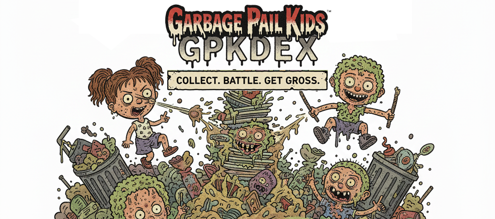

# GPK Dex Bot

A Discord bot for collecting and trading Garbage Pail Kids (GPK) cards, featuring a comprehensive card system with multiple series, rarity tiers, puzzles, and an economy system.

## Features

### Card Collection System
- **15 Original Series (OS1-OS15)** with varying rarities (Common to Ultra Rare)
- **3 Flashback Series (FB1-FB3)** - Legendary tier cards
- **White Border Error Series** - Epic tier (rarest cards)
- **18 Prime Slime TV Series** - Rare tier cards across different TV themes
- **A and B Variants** for most cards with different names
- **Puzzle System** - Collect pieces to complete 9-piece puzzles from various series

### Economy & Progression
- **Level System** - Gain XP from catching cards and completing trades
- **Coin System** - Earn coins through daily claims and level-ups
- **Daily Rewards** - Claim daily coins and XP (rewards scale with level)
- **Card Packs** - Purchase packs containing 4 random cards + potential puzzle pieces
- **Rarity Multipliers** - Higher rarity cards have better B variant and puzzle drop rates

### Trading & Gifting
- **Player-to-Player Trading** - Trade cards and puzzle pieces with confirmation system
- **Gift System** - Give cards or coins to other players with confirmation
- **Trade Management** - Add/remove cards and puzzle pieces before finalizing

### Card Catching
- **Automatic Spawns** - Cards spawn randomly in designated channels
- **Spawn Cooldowns** - Balanced spawn rates to keep engagement high
- **Catch Competition** - First player to catch gets the card

### Collection Tracking
- **Profile Stats** - View level, XP, coins, total cards, and unique cards
- **Collection View** - See cards organized by series with completion percentages
- **Rarity Tags** - Cards tagged with rarity levels (Common, Uncommon, Rare, etc.)
- **Leaderboards** - Top 10 collectors ranked by unique cards
- **Collection Comparison** - Compare your collection with other players

### Crafting
- **B Variant Crafting** - Combine 3 A variant cards into 1 B variant card

## Installation

### Prerequisites
- Python 3.8 or higher
- Discord Bot Token
- Discord Server with Admin permissions

### Setup

1. Clone the repository:
```bash
git clone https://github.com/yourusername/gpkdex.git
cd gpkdex
```

2. Install required dependencies:
```bash
pip3 install discord.py aiosqlite pillow
```

3. Create a `.env` file in the project directory:
```bash
DISCORD_TOKEN=your_bot_token_here
BOT_OWNER_ID=your_discord_user_id
```

4. Run the bot:
```bash
python3 bot.py
```

### Getting Your Discord Bot Token

1. Go to [Discord Developer Portal](https://discord.com/developers/applications)
2. Click "New Application" and give it a name
3. Go to the "Bot" section and click "Add Bot"
4. Under the bot's token section, click "Copy" to get your token
5. Enable these Privileged Gateway Intents:
   - Presence Intent
   - Server Members Intent
   - Message Content Intent
6. Go to OAuth2 > URL Generator
7. Select scopes: `bot` and `applications.commands`
8. Select permissions: `Send Messages`, `Embed Links`, `Attach Files`, `Read Message History`, `Use Slash Commands`
9. Copy the generated URL and use it to invite the bot to your server

### Finding Your Discord User ID

1. Enable Developer Mode in Discord (User Settings > Advanced > Developer Mode)
2. Right-click your username and select "Copy ID"

## Configuration

### Setting Up the Spawn Channel

After inviting the bot to your server, use:
```
/gpksetspawn #channel
```
This sets where cards will automatically spawn.

### Syncing Commands

If slash commands don't appear, use:
```
/gpksync
```
This will sync all slash commands with Discord.

## Commands Reference

### Collection & Economy
- `/gpkdaily` - Claim daily coins and XP (varies by level)
- `/gpkclaim` - Claim a free random card (1 hour cooldown)
- `/gpkleveledclaim` - Claim a card with boosted B variant and puzzle piece chance (12 hour cooldown)
- `/gpkopen` - Open a card pack for 5,000 coins (contains 4 cards + possible puzzle piece)
- `/gpkcollection [user] [series]` - View card collection grouped by series with completion stats
- `/gpkprofile [user]` - View profile stats including level, XP, coins, and collection progress

### Cards & Catching
- `/gpkcatch` - Catch a spawned card or puzzle piece that appears in the spawn channel
- `/gpkshow <card>` - Display a specific card from your collection with its image
- `/gpkcraft <card>` - Craft 3 A variant cards into 1 B variant card

### Puzzles
- `/gpkpuzzles` - View puzzle collection progress and complete finished puzzles

### Trading & Gifting
- `/gpktrade [@user]` - Start a new trade or view your active trade
- `/gpktradeadd <card> [quantity]` - Add cards to your trade offer
- `/gpktraderemove <card> [quantity]` - Remove cards from your trade offer
- `/gpktradeaddpiece <puzzle> <piece> [quantity]` - Add puzzle pieces to your trade offer
- `/gpktraderemovepiece <puzzle> <piece> [quantity]` - Remove puzzle pieces from your trade offer
- `/gpktradecancel` - Cancel your active trade
- `/gpkgivecard @user <card> [quantity]` - Give cards to another user (with confirmation)
- `/gpkgivecoins @user <amount>` - Give coins to another user (with confirmation)

### Leaderboard
- `/gpkleaderboard` - View the top 10 collectors ranked by unique cards owned
- `/gpkcompare @user` - Compare your collection to another user's

### Server Setup (Admin Only)
- `/gpksetspawn #channel` - Set the channel where cards spawn (requires admin permissions)
- `/gpksync` - Sync slash commands with Discord (requires admin permissions)

### Bot Owner Only
- `/gpkforcespawn` - Manually spawn a card in the spawn channel
- `/gpkspawnpuzzle` - Manually spawn a puzzle piece in the spawn channel

### Help
- `/gpkhelp` - Display interactive help menu with all commands and game info

## Card Series Information

### Rarity Tiers

| Tier | Series | B Variant Chance | Puzzle Piece Chance |
|------|--------|------------------|---------------------|
| Epic | White Border | 15% | 25% |
| Legendary | Flashback 1-3 | 10% | 20% |
| Ultra Rare | OS 3, 4, 6, 7 | 8% | 15% |
| Rare | OS 8-15, TV Series | 6% | 12% |
| Uncommon | OS 1, 2, 5 | 5% | 10% |
| Common | (Base rate) | 3% | 8% |

### Series Details

- **Original Series (OS1-OS15)**: Classic GPK cards from the original 15 series
- **Flashback Series (FB1-FB3)**: Special flashback editions with legendary status
- **White Border Error**: Extremely rare white border error prints (Epic tier)
- **Prime Slime TV**: 18 different TV-themed series including Drama, Sci-Fi, Cartoon, Horror, and more

## Database

The bot uses SQLite with Write-Ahead Logging (WAL) mode for concurrent access. The database (`gpkdex.db`) is automatically created on first run.

### Tables
- `users` - Player profiles, coins, XP, levels
- `cards` - All available cards in the game
- `inventory` - Player card ownership
- `puzzles` - Available puzzles
- `puzzle_inventory` - Player puzzle piece ownership
- `trades` - Active trade sessions
- `trade_items` - Cards/pieces in trades
- `spawn_channel` - Configured spawn channel per server
- `last_claim` - Cooldown tracking for claim commands
- `last_daily` - Cooldown tracking for daily rewards

## Technical Details

### Dependencies
- `discord.py` - Discord API wrapper
- `aiosqlite` - Async SQLite database
- `pillow` (PIL) - Image processing for card displays
- `python-dotenv` - Environment variable management

### Card Images
Card images are stored in series-specific directories:
- `os{1-15}_images/` - Original Series images
- `fb_images/` - Flashback Series images
- `wb_images/` - White Border Error images
- `tv_{theme}_images/` - TV Series images (18 different themes)

Image naming format: `{series}_{number}{variant}.jpg`
Example: `os1_1a.jpg`, `fb1_25b.jpg`, `wb_40a.jpg`

### Concurrent User Support
The bot is configured to handle multiple concurrent users with:
- SQLite WAL mode for better concurrent access
- 30-second database timeout
- Busy timeout pragma for handling locks
- Command deferring for long-running operations

## Contributing

Contributions are welcome! Please feel free to submit a Pull Request.

## License

This project is for educational and entertainment purposes.

## Support

For issues or questions, please open an issue on GitHub or contact the bot owner.

## Credits

Garbage Pail Kids is a trademark of The Topps Company, Inc. This bot is a fan project and is not affiliated with or endorsed by Topps.

---

## Support the Developer

If you enjoy this bot and would like to support its development, consider buying me a coffee!

[](https://ko-fi.com/brainphreak)

Your support helps keep this project alive and enables new features and improvements!
